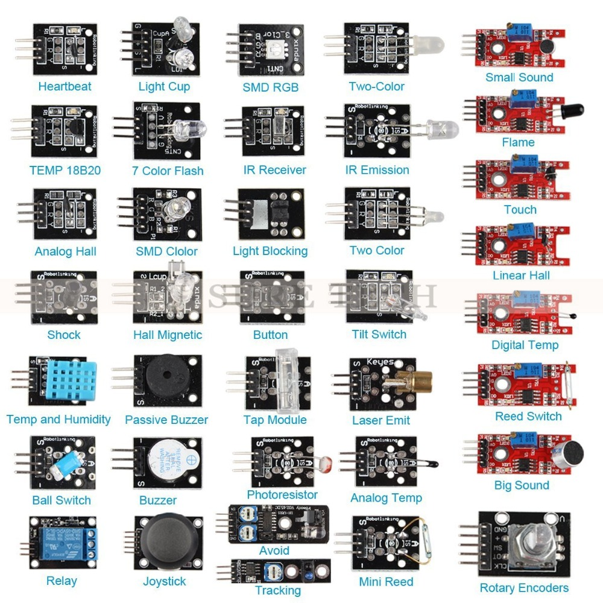

# SensorTechnology2017tju
## Final project requirements
### (1) Use at least  one of these sensors with Arduino Nano to build a useful & innovative & interesting application project.
* DHT11 humidity& temperature sensor
* GY-80(10 DOF:degree of freedom) a gyroscope, accelerometer, digital compass, and a barometric pressure / temperature sensor. 
* GY85(9DOF)
* HC-SR04 Ultrasonic Distance Sensor Module
* Thermistor (Resistance=10K B=3435K)
* Photo-resistor (CdS photo-resistor)
* Sensors below 
### (2) Arduino software
### (3) GUI APP on PC Windows/Linux. The APP can visually display Sensor information & control arduino I/O port. GUI-APP and arduino exchange information through Serial port.(Computer language is not limited.)

## Final Result & Demonstration:
### (1) Project report: Project specification, design documents(hardware & software), Presentation PPT.
### (2) Source code of Arduino & GUI APP.
### (3) Experience and suggestions about this class. 

## Submission deadline: Oct. 30, 2017
